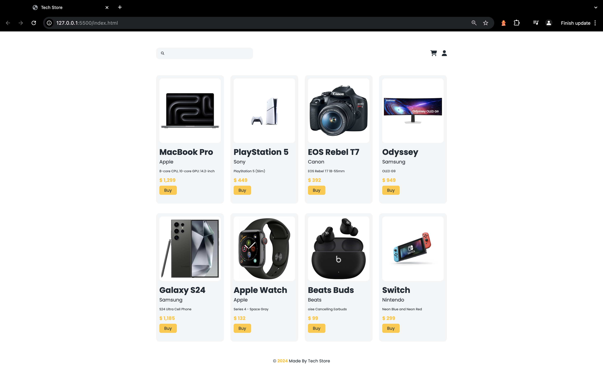

# Tech Store

This project is a simple web store built using HTML, SCSS, and JavaScript, designed to showcase various tech products. The main purpose of this project is to practice CSS Grid layout while dynamically rendering HTML content from simulated data fetches.

To achieve this, I created an array of objects representing the products. Each object contains details such as name, price, and image. By iterating through this array, I dynamically generate product cards that display the information in a visually appealing format.

## Features

- Dynamic Content Rendering: Products are rendered on the page based on the data from the JavaScript array, demonstrating the ability to work with dynamic content.

- Modern Styling: Utilizes SCSS for advanced styling, showcasing a clean and modern aesthetic for the store.

## Technologies

- HTML
- SCSS
- JavaScript

## Screenshots

## Deployment

To deploy this project click on the next link

https://johanh0.github.io/Tech-Store/

## 🔗 Links

